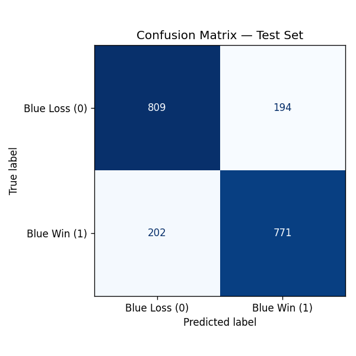
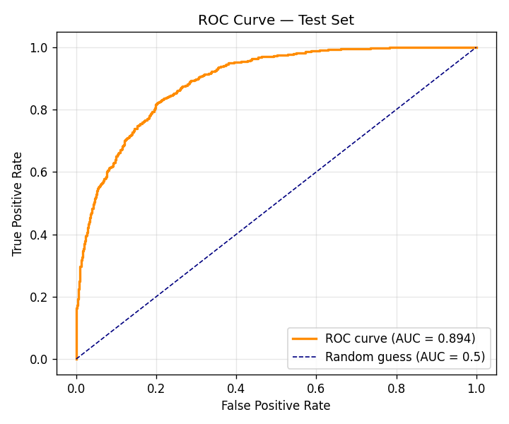
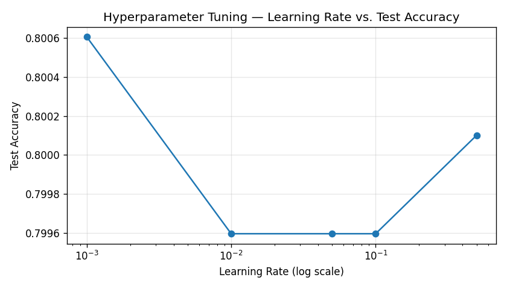
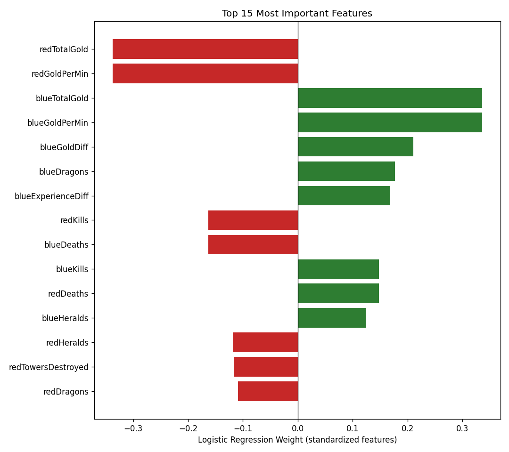

 

<p align="center">
  <h1 align="center">🎮 League of Legends Match Predictor</h1>
  <p align="center">
    Predicting Ranked Match Outcomes Using Early-Game Statistics and Logistic Regression in PyTorch
  </p>
</p>

<p align="center">


</p>

---

## 📖 Project Overview

This project implements a **Logistic Regression classification model using PyTorch**
to predict the outcome of ranked **League of Legends** matches based on
early-game team statistics captured at the **10-minute mark**.

The model learns patterns from gold generation, combat performance,
objective control, vision score, and resource accumulation to estimate
whether the **Blue Team** will ultimately win the match.

Developed as part of the **Final Project: League of Legends Match Predictor** assignment.

---

## 🎯 Objective

Predict:

```text
blueWins
```

Where:

- `1` = Blue Team Wins
- `0` = Blue Team Loses

Using team-level statistics captured during the first 10 minutes of gameplay:

- Kills
- Deaths
- Assists
- Gold
- Experience
- Wards
- Dragons
- Heralds
- Towers
- Creep Score (CS)
- And additional early-game performance indicators

---

## 🏗️ Machine Learning Pipeline

```text
League of Legends Match Data
                │
                ▼
       Data Preprocessing
                │
                ▼
        Feature Scaling
         (StandardScaler)
                │
                ▼
      Train/Test Split (80/20)
                │
                ▼
      Logistic Regression Model
            (PyTorch)
                │
                ▼
      Binary Classification
                │
                ▼
      Performance Evaluation
```

---

## 📂 Project Structure

```text
lol_project/
├── README.md
├── requirements.txt
│
├── data/
│   ├── generate_dataset.py
│   ├── build_notebook.py
│   └── league_of_legends_data_stats.csv
│
├── notebook/
│   ├── Final_Project_League_of_Legends_Match_Predictor.ipynb
│   └── league_of_legends_data_stats.csv
│
├── models/
│   └── logistic_regression_model.pth
│
├── images/
│   ├── training_loss.png
│   ├── confusion_matrix.png
│   ├── roc_curve.png
│   ├── lr_tuning.png
│   └── feature_importance.png
│
└── answers/
    └── Assignment_Answers.md
```

---

## 📊 Dataset

### Dataset Overview

| Attribute | Value |
|------------|---------|
| Matches | 9,879 |
| Features | 36 |
| Target | `blueWins` |
| Total Columns | 37 |
| Random Seed | 42 |
| Class Distribution | ~50/50 |

The dataset is modeled after the well-known:

> **High Diamond Ranked 10-Minute League of Legends Dataset**

and contains team-level statistics for both Blue and Red teams.

### Reproducibility

The dataset is generated using:

```bash
data/generate_dataset.py
```

with a fixed random seed (`42`) to ensure fully reproducible results.

> If your course provides an official dataset file, simply replace
> `league_of_legends_data_stats.csv` in both `data/` and `notebook/`
> directories and re-run the notebook.

---

## 🧠 Model Architecture

### Logistic Regression (PyTorch)

```python
class LogisticRegressionModel(nn.Module):
    def __init__(self, input_dim):
        super().__init__()
        self.linear = nn.Linear(input_dim, 1)

    def forward(self, x):
        return torch.sigmoid(self.linear(x))
```

### Training Configuration

| Parameter | Value |
|------------|---------|
| Framework | PyTorch |
| Loss Function | Binary Cross Entropy |
| Optimizer | Adam |
| Weight Decay | 0.01 |
| Epochs | 1000 |
| Feature Scaling | StandardScaler |
| Train/Test Split | 80/20 Stratified |

---

## 📈 Model Performance

### Evaluation Metrics

| Metric | Value |
|---------|---------|
| Train Accuracy | **81.63%** |
| Test Accuracy | **79.96%** |
| Precision | **0.7990** |
| Recall | **0.7924** |
| F1 Score | **0.7957** |
| ROC AUC | **0.8935** |

### Hyperparameter Tuning

| Parameter | Best Value |
|------------|------------|
| Learning Rate | **0.001** |
| Test Accuracy | **80.06%** |

### Most Important Features

🥇 `redTotalGold`

🥈 `redGoldPerMin`

🥉 `blueTotalGold`

---
## 📊 Results & Visualizations

The model was evaluated using multiple performance metrics and visual diagnostic plots.

---

### 📉 Training Loss Curve

Tracks the model's learning progress across training epochs.

<p align="center">
  
>
</p>

---

### 📊 Confusion Matrix

Shows classification performance across True Positives, True Negatives,
False Positives, and False Negatives.

<p align="center">
  
</p>

---

### 📈 ROC Curve

Evaluates the model's ability to distinguish between winning and losing teams.

<p align="center">
  
</p>

---

### ⚙️ Learning Rate Tuning

Comparison of different learning rates and their impact on model performance.

<p align="center">
  
</p>

---

### 🔍 Feature Importance Analysis

Highlights the most influential features driving match outcome predictions.

<p align="center">
  
</p>

---

### 🎯 Performance Summary

| Metric | Score |
|----------|----------|
| Train Accuracy | **81.63%** |
| Test Accuracy | **79.96%** |
| Precision | **0.7990** |
| Recall | **0.7924** |
| F1 Score | **0.7957** |
| ROC AUC | **0.8935** |


Located in:

```text
images/
```

---

## 🚀 How to Reproduce

### 1. Create Environment

```bash
python -m venv venv
source venv/bin/activate
```

### 2. Install Dependencies

```bash
pip install -r requirements.txt
```

### 3. (Optional) Regenerate Dataset

```bash
cd data
python generate_dataset.py
cd ..
```

### 4. Run Notebook

```bash
jupyter notebook notebook/Final_Project_League_of_Legends_Match_Predictor.ipynb
```

### 5. Execute Headlessly

```bash
jupyter nbconvert --to notebook --execute --inplace \
notebook/Final_Project_League_of_Legends_Match_Predictor.ipynb
```

---

## ✅ Assignment Submission Checklist

- [x] Q1 — Upload completed notebook
- [x] Q2–Q10 — Assignment answers completed
- [x] Model training completed
- [x] Evaluation metrics generated
- [x] Visualizations generated
- [x] Reproducible workflow documented

---

## 📦 Dependencies

Core libraries used in this project:

- PyTorch
- Pandas
- NumPy
- Scikit-Learn
- Matplotlib

Install all dependencies:

```bash
pip install -r requirements.txt
```

---

## 🛠️ Skills Demonstrated

- Machine Learning
- Binary Classification
- Logistic Regression
- PyTorch
- Feature Engineering
- Data Preprocessing
- Model Evaluation
- Hyperparameter Tuning
- Data Visualization
- Reproducible ML Workflows

---

## 📄 License

This project was developed as part of the

**Final Project: League of Legends Match Predictor**

for academic and educational purposes.

---

<p align="center">
  <strong>Built with PyTorch • Machine Learning • Data Science • League of Legends Analytics</strong>
</p>
